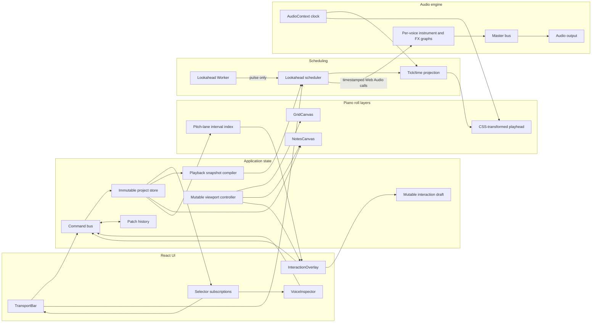
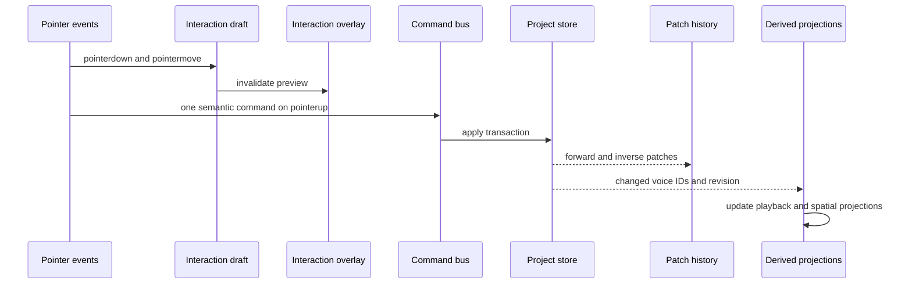

# Architecture du piano roll

## 1. Portée et décisions structurantes

Ce document décrit les fondations, les frontières de responsabilité et les contrats. Il ne constitue pas une implémentation de l’application.

Les décisions structurantes sont les suivantes :

1. Le tick est l’unité temporelle persistée. La valeur initiale recommandée est `960 PPQN`. Les pixels, secondes et cellules de quantification ne sont que des projections.
2. Une note est toujours possédée par une voix. Le stockage autoritaire est partitionné dans `tracksByVoiceId`; il n’existe pas de tableau global de notes.
3. React pilote la composition de l’interface et les états à faible fréquence. Il ne pilote ni l’horloge audio, ni la tête de lecture, ni les déplacements intermédiaires du pointeur.
4. L’audio consomme un `PlaybackSnapshot` immuable, compact et versionné, compilé à partir du projet. Il ne lit jamais le DOM ni l’arbre React.
5. Une action utilisateur continue est prévisualisée dans un brouillon mutable, puis validée comme une seule transaction annulable.
6. Les index de lecture et de hit-testing sont des projections dérivées. Ils ne sont ni sérialisés, ni inclus dans l’historique.

Les contrats TypeScript associés sont répartis ainsi :

- `src/domain/model.ts` : modèle métier, voix, transport et configuration audio ;
- `src/audio/contracts.ts` : snapshots de lecture et ports du moteur ;
- `src/piano-roll/contracts.ts` : viewport, coordonnées et index spatial ;
- `src/react/hooks.contracts.ts` : signatures des adaptateurs React.

## 2. Flux architectural global



Le Worker n’exécute pas de Web Audio et ne transporte pas les notes une par une. Il émet uniquement des impulsions de réveil. Le scheduler utilise alors `AudioContext.currentTime`, détermine une fenêtre d’anticipation et remet au moteur des commandes horodatées.

## 3. Modèle métier et invariants

### 3.1 Organisation par voix

`ProjectState` est normalisé autour de quatre sections :

- `voicesById` contient les métadonnées et la configuration de chaque voix ;
- `voiceOrder` définit uniquement l’ordre d’affichage ;
- `tracksByVoiceId[voiceId].notesById` contient les événements de cette voix.
- `transportSettings` contient le tempo, la signature, la boucle et le swing persistés.

Cette séparation rend les opérations par voix explicites : mute/solo, routage audio, transformation générative, export, rendu et suppression. Une commande qui déplace une note vers une autre voix doit supprimer et ajouter la note dans la même transaction atomique.

Invariants à contrôler à la frontière des commandes et lors du chargement :

- `0 <= pitch <= 127`;
- `0 <= velocity <= 127`;
- `startTick >= 0`;
- `durationTicks > 0`;
- `ppqn` est un entier strictement positif ;
- `note.voiceId === track.voiceId`;
- tout `voiceId` référencé existe dans `voicesById`;
- `loop.startTick < loop.endTick`;
- `bpm > 0`;
- la signature temporelle a un numérateur positif et un dénominateur accepté.

Les alias numériques expriment l’intention, mais ils ne valident pas les valeurs à l’exécution. La validation doit se faire dans les fabriques, les commandes et le désérialiseur, jamais dans la boucle audio.

### 3.2 Temps, quantification et interprétation

Une note conserve toujours ses ticks absolus. Le changement de résolution de grille ne réécrit donc aucune note. La quantification est une commande explicite appliquant une fonction du type :

```ts
type TickQuantizer = (tick: Tick, resolutionTicks: Tick) => Tick;
```

Le swing et les micro-décalages d’interprétation sont appliqués lors de la compilation ou de la projection vers le temps audio. Ils ne déplacent pas automatiquement `startTick`. Cette distinction permet de changer le groove sans perte de l’intention originale.

Pour préparer les changements de tempo, `PlaybackSnapshot` possède une `TempoMapSnapshot`. La première version peut contenir un seul segment à `startTick = 0`; le scheduler reste néanmoins compatible avec une carte de tempo segmentée.

### 3.3 Contrats TypeScript

Les interfaces demandées sont définies dans les fichiers de contrats. Les propriétés métier sont `readonly` afin d’imposer des mises à jour par remplacement et de permettre le partage structurel.

`Voice` utilise une union discriminée `InstrumentConfig`. La synthèse soustractive est le premier membre opérationnel. La synthèse FM dispose déjà de sa frontière de configuration, sans imposer son implémentation.

`TransportState` stocke une ancre plutôt qu’une position mise à jour à chaque image :

- `anchorTick` est la position au dernier start, seek, pause ou changement de tempo ;
- `anchorAudioTimeSeconds` est l’instant correspondant sur l’horloge audio pendant la lecture ;
- la position courante est dérivée de ces deux valeurs et de la carte de tempo.

Cette forme évite d’envoyer 60 écritures par seconde dans le store.

## 4. Gestion d’état et Undo/Redo

### 4.1 Trois classes d’état

| Classe | Exemples | Propriétaire | Notification |
|---|---|---|---|
| Persistant et annulable | notes, voix, instruments, tempo, signature | store immuable | sélecteurs ciblés |
| UI à faible fréquence | voix active, panneau ouvert, résolution, zoom validé | store UI ou état React local | rendu React |
| Volatile temps réel | tick audible, scroll courant, hover, lasso, drag fantôme, curseurs du scheduler | contrôleurs mutables et refs | Canvas, DOM direct ou abonnement dédié |

Le store applicatif doit exposer une API compatible avec `useSyncExternalStore` et des sélecteurs par tranche. Un Context React contenant tout le projet entraînerait des invalidations trop larges.

Le scroll et le brouillon d’interaction ne doivent pas être publiés dans le store à chaque événement. Les contrôleurs mutables maintiennent leur dernière valeur et déclenchent uniquement l’invalidation de la couche concernée.

### 4.2 Pipeline d’une commande



Le Command Bus groupe les modifications avec un `transactionId`. Un déplacement de 200 événements `pointermove` ne produit donc qu’une entrée d’historique au `pointerup`.

L’historique conserve des patches avant/arrière, pas des copies complètes du projet. L’Undo applique les patches inverses dans l’ordre inverse et place l’entrée dans `future`; toute nouvelle commande après Undo vide `future`. Les snapshots immuables permettent aux lecteurs en cours de terminer sans verrou.

Les éléments suivants ne font pas partie de l’historique :

- la sélection et le hover ;
- le scroll et la position instantanée de la tête de lecture ;
- les `AudioNode`;
- les index spatiaux ;
- les snapshots compilés, qui sont reconstruits à partir de la révision restaurée.

Pour limiter la mémoire, l’historique doit avoir un budget configurable en octets ou un nombre maximal de transactions. Une sauvegarde sérialise uniquement `ProjectState`, avec `schemaVersion` pour les migrations.

## 5. Arbre React et couches de rendu

```text
AppShell
├── TransportBar
├── Workspace
│   ├── PianoRollPanel
│   │   ├── PianoKeyboard
│   │   └── PianoRollViewport
│   │       └── PianoRollLayerStack
│   │           ├── GridCanvas
│   │           ├── NotesCanvas
│   │           └── InteractionOverlay
│   │               ├── Playhead
│   │               ├── SelectionLasso
│   │               └── NoteGhosts
│   └── VoiceInspector
└── ShortcutScope
```

`PianoRollLayerStack` est un conteneur `position: relative; overflow: hidden; isolation: isolate`. Ses trois enfants couvrent exactement le même rectangle avec `position: absolute; inset: 0`.

### 5.1 GridCanvas

La géométrie des lignes de pitch et des divisions temporelles est précalculée dans des tuiles ou un `OffscreenCanvas`. Le cache est invalidé sur :

- changement de zoom ;
- changement de résolution ;
- changement de thème ou de signature ;
- resize ou changement de DPR.

Pendant le scroll, la géométrie n’est pas recalculée. Les tuiles en cache sont déplacées/composées selon l’offset du viewport. Cette nuance évite à la fois un canvas couvrant un morceau potentiellement immense et un recalcul complet à chaque pixel de scroll.

### 5.2 NotesCanvas

`NotesCanvas` lit une révision immuable et interroge l’index en coordonnées musicales pour la fenêtre visible. Le culling porte sur :

```text
[visibleStartTick, visibleEndTick] × [visibleMinPitch, visibleMaxPitch]
```

Le dessin est regroupé par voix et par couleur afin de réduire les changements de `fillStyle`. Les libellés, poignées ou contours ne sont rendus qu’au-delà d’un seuil de zoom utile. Un changement de sélection peut être rendu dans l’overlay pour éviter de repeindre toutes les notes.

### 5.3 InteractionOverlay

Cette couche reçoit les événements pointeur et clavier. Elle garde un état de geste mutable et appelle `setPointerCapture` pendant un drag. Les mouvements mettent à jour les fantômes, le lasso ou le hover sans toucher aux deux canvases.

Les listeners haute fréquence sont natifs et installés par `usePianoRollEvents`; ils ne dépendent pas d’un nouvel objet de props à chaque rendu. Les raccourcis sont interprétés selon un scope explicite afin de ne pas intercepter la saisie dans l’inspecteur.

### 5.4 HiDPI

Les coordonnées de layout restent toujours en pixels CSS. Pour chaque canvas :

```text
backingWidth  = round(cssWidth  × devicePixelRatio)
backingHeight = round(cssHeight × devicePixelRatio)
```

Après redimensionnement du backing store, le contexte est remis à l’identité puis mis à l’échelle avec le DPR. Il ne faut pas accumuler plusieurs appels à `scale`. Un `ResizeObserver` et l’observation du DPR déclenchent une invalidation `resize`.

## 6. Conversion de coordonnées et hit-testing

Avec `scrollX` et `scrollY` en pixels CSS :

```text
tick  = scrollX + pixelX, then multiplied by ticksPerCssPixel
row   = floor((scrollY + pixelY) / pitchHeightCssPixels)
pitch = maxPitch - row

pixelX = tick / ticksPerCssPixel - scrollX
pixelY = (maxPitch - pitch) × pitchHeightCssPixels - scrollY
```

La forme exacte doit centraliser le point d’origine et le sens vertical dans un seul `CoordinateConverter`. La quantification est appliquée après la conversion et seulement pour les opérations qui la demandent. Le hit-testing utilise les coordonnées continues avant quantification.

L’index recommandé exploite le domaine borné des pitches :

- 128 buckets, un par pitch MIDI ;
- dans chaque bucket, un interval tree ou une structure triée par `startTick` avec `maxEndTick` ;
- stockage en coordonnées musicales, donc indépendant du zoom et du DPR ;
- requête ponctuelle en `O(log n + k)` sur un pitch ;
- requête rectangulaire sur le faible nombre de buckets visibles.

Cette structure est plus spécialisée et moins coûteuse qu’un R-tree 2D général. Une implémentation par tableaux triés peut suffire en première version si les insertions sont groupées à la validation des commandes.

`SpatialIndex.queryPoint` et `queryRect` écrivent dans un tableau fourni par l’appelant et renvoient un compteur. Ce contrat permet de réutiliser le même buffer lors des événements `pointermove`.

## 7. Hooks métier

Les hooks sont des adaptateurs de cycle de vie. Les services qu’ils connectent restent testables sans React.

### `useLookaheadScheduler`

```ts
declare function useLookaheadScheduler(
  options: UseLookaheadSchedulerOptions,
): SchedulerController;
```

Responsabilités :

- créer et arrêter le Worker avec le composant racine audio ;
- transmettre ses pulses au `SchedulerController`;
- remplacer le snapshot seulement lors d’une nouvelle révision ;
- suspendre proprement les abonnements au démontage ;
- ne jamais copier les notes dans un état React.

### `useCanvasRenderer`

```ts
declare function useCanvasRenderer<TSnapshot>(
  options: UseCanvasRendererOptions<TSnapshot>,
): CanvasRendererController;
```

Responsabilités :

- appliquer le resize HiDPI ;
- coalescer plusieurs invalidations dans une seule frame ;
- obtenir le snapshot au moment du dessin pour éviter les closures obsolètes ;
- annuler la frame pendante au démontage ;
- ne jamais utiliser `setState` dans la boucle de rendu.

### `usePianoRollEvents`

```ts
declare function usePianoRollEvents(
  options: UsePianoRollEventsOptions,
): void;
```

Responsabilités :

- installer les listeners natifs sur l’overlay ;
- convertir les coordonnées une fois par événement ;
- interroger l’index spatial avec un buffer réutilisable ;
- mettre à jour le brouillon mutable pendant le geste ;
- créer une commande métier unique lors de la validation ;
- annuler le geste sur `pointercancel`, perte de focus ou touche Escape.

## 8. Lookahead Scheduler

### 8.1 Paramètres initiaux

Valeurs de départ recommandées, à rendre configurables et à mesurer :

```ts
const initialSchedulerConfig = {
  schedulerPulseIntervalMs: 25,
  scheduleAheadSeconds: 0.12,
  lateEventToleranceSeconds: 0.01,
} as const;
```

La fenêtre d’anticipation doit être nettement supérieure à l’intervalle du Worker. Une fenêtre trop courte expose aux blocages du main thread; une fenêtre trop longue rend les éditions et changements de tempo moins réactifs.

### 8.2 Cycle de planification

Au démarrage :

1. `AudioContext.resume()` est appelé à la suite d’un geste utilisateur.
2. Le transport capture `anchorTick` et `anchorAudioTimeSeconds`.
3. Le scheduler adopte le dernier `PlaybackSnapshot` et incrémente sa génération.
4. Le Worker démarre ses pulses périodiques.

À chaque pulse :

```text
now = audioContext.currentTime
horizon = now + scheduleAheadSeconds
windowStart = max(scheduledUntil, now)

if horizon > windowStart:
    project the audio window to tick ranges
    scan each voice from its reusable cursor
    schedule note on/off times on the AudioContext timeline
    scheduledUntil = horizon
```

La projection ticks/secondes intègre chaque segment de tempo traversé. À `120 BPM` et `960 PPQN`, un tick vaut `60 / (120 × 960)` seconde avant interprétation. La signature temporelle sert au découpage musical et à l’affichage; elle ne modifie pas à elle seule la durée d’un tick.

Pour une boucle, une fenêtre qui traverse `loop.endTick` est divisée en deux plages. Chaque instance planifiée appartient à la génération de transport courante afin d’éviter de confondre deux répétitions de la même note.

Lors d’un seek, stop, changement de tempo ou remplacement incompatible du snapshot :

- incrémenter la génération ;
- annuler/arrêter les nœuds futurs connus à partir d’une marge sûre ;
- remettre à zéro les curseurs par voix ;
- replacer `scheduledUntil`;
- replanifier depuis la nouvelle ancre.

Les événements déjà audibles ne peuvent pas être « désordonnancés ». La petite fenêtre de lookahead borne ce délai. Une politique explicite doit décider si un seek déclenche les notes qui ont commencé avant le curseur mais dont la durée le traverse, fonctionnalité souvent appelée note chase.

### 8.3 Précision réelle

Le Worker rend les réveils plus robustes aux variations des timers du main thread, mais il ne garantit pas qu’un main thread bloqué plus longtemps que toute la fenêtre se réveillera à temps. La précision dite sample-accurate commence une fois les appels `start(when)`, `stop(when)` et les automatisations `AudioParam` remis à l’`AudioContext`.

Pour une évolution nécessitant une résilience plus forte aux longues tâches du main thread, le même `PlaybackSnapshot` compact pourra être consommé par un `AudioWorklet`. Ce changement ne doit pas être nécessaire pour la première étape.

### 8.4 Stratégie anti-GC

La boucle chaude doit :

- parcourir des `Float64Array` et `Uint8Array` préparés hors lecture ;
- conserver un curseur numérique réutilisable par voix ;
- recevoir un pulse primitif du Worker plutôt qu’un objet de note ;
- réutiliser les tableaux de résultats et les records de voix actives ;
- éviter `map`, `filter`, spreads, closures et chaînes temporaires ;
- compiler les règles génératives avant la lecture ou par fenêtres déterministes ;
- ne jamais construire un nouveau snapshot dans le callback du Worker.

La création d’un `OscillatorNode` par note reste une allocation native inévitable pour le synthétiseur initial. L’objectif est d’éviter le churn JavaScript autour de cette allocation. Les oscillateurs sont jetables et ne doivent pas être remis dans un pool après `stop`.

## 9. Graphe audio et cycle de vie

Le graphe cible par voix est :

```text
OscillatorNode
    → per-note GainNode with ADSR
    → voice instrument output
    → ordered FX chain
    → voice GainNode
    → voice StereoPannerNode
    → master GainNode
    → AudioContext.destination
```

Les paramètres ADSR appartiennent à la voix, mais l’enveloppe est appliquée par note. `cancelScheduledValues`, `setValueAtTime`, les rampes et `stop(releaseEnd)` utilisent tous l’horloge du contexte.

Chaque note planifiée possède un handle interne avec sa génération et ses nœuds jetables. À la fin :

1. l’oscillateur est stoppé après la release ;
2. `onended` déclenche un nettoyage minimal ;
3. les nœuds jetables sont déconnectés ;
4. leurs références sont retirées du registre actif ;
5. le record JavaScript peut retourner dans un petit pool.

Les bus de voix, le master et les chaînes d’effets vivent aussi longtemps que leur configuration. Lors d’un remplacement de chaîne, l’ancien graphe est déconnecté après son tail time afin de ne pas couper brutalement reverb ou delay.

`panic()` doit être synchrone du point de vue du contrôleur :

- invalider la génération courante ;
- stopper toutes les sources actives et futures au plus tôt ;
- annuler les automations des gains ;
- forcer les gains de voix à zéro avec une rampe de sécurité très courte ;
- vider le registre des notes actives et les curseurs ;
- envoyer un éventuel All Notes Off aux sorties MIDI futures.

`dispose()` arrête le Worker, appelle `panic`, déconnecte les graphes persistants, retire les listeners puis ferme le contexte si l’application en est propriétaire.

## 10. Tête de lecture synchronisée à l’audio

La tête de lecture n’est pas une valeur React. Un contrôleur `requestAnimationFrame` lit l’ancre de transport et l’horloge audio, projette le tick, le convertit en pixel puis écrit uniquement :

```ts
playheadElement.style.transform = `translate3d(${xCssPixels}px, 0, 0)`;
```

Pour aligner le visuel sur le signal réellement entendu, utiliser `AudioContext.getOutputTimestamp()` quand disponible. Son couple `contextTime/performanceTime` permet d’estimer l’instant du contexte présent à la sortie au moment de la frame. Le fallback est `currentTime - baseLatency - outputLatency`, ajusté par `latencyCompensationSeconds`.

La valeur est recalée à chaque start, pause, seek, boucle et changement de tempo. Une correction importante doit être appliquée immédiatement; les petites erreurs d’estimation peuvent être lissées visuellement sans altérer l’horloge audio.

À l’arrêt, la dernière transform reste affichée et aucune frame n’est demandée. L’overlay peut publier occasionnellement un tick arrondi pour l’accessibilité ou l’affichage textuel, mais pas à 60 Hz dans le store global.

## 11. Ordre de réalisation recommandé

1. Valider les invariants et le reducer transactionnel sur le modèle par voix.
2. Implémenter le convertisseur de coordonnées et ses tests aller-retour.
3. Mettre en place les trois couches avec resize HiDPI et invalidations séparées.
4. Ajouter l’index par pitch et le culling de `NotesCanvas`.
5. Implémenter les gestes avec brouillon mutable et commit unique.
6. Compiler `ProjectState` vers `PlaybackSnapshot`.
7. Construire le moteur soustractif et son nettoyage sans React.
8. Brancher Worker, scheduler, transport et tête de lecture.
9. Mesurer frame time, dérive, notes tardives, mémoire et coût des grosses transactions.

Les tests les plus structurants portent sur les conversions tick/seconde aux frontières de tempo, le wrap de boucle, l’Undo/Redo multi-note, la cohérence `voiceId`, le hit-testing après zoom/scroll et l’absence de nœuds actifs après `panic`.
